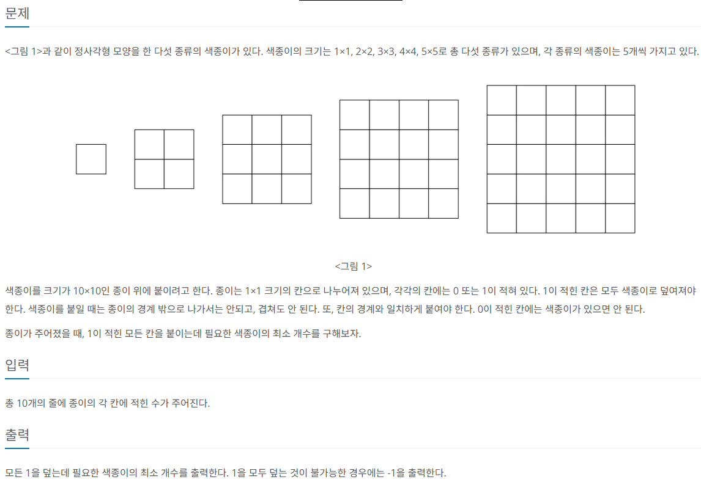

```c++
#include <iostream>
#include <vector>
#include<bits/stdc++.h>
using namespace std;

int n, k;
int w, v;
vector<pair<int, int>> c;

int dp[104][100004];

int main() {

	cin >> n >> k;
	c.push_back(pair<int,int>(0,0));
	for (int i = 0; i < n; i++) {
		cin >> w >> v;
		c.push_back(pair<int, int>(w, v));
	}
	
	memset(dp, 0, sizeof(dp));

	for (int i = 1; i <= n; i++) { // i=1 : 1번째 물건만 포함
		for (int j = 1; j <= k; j++) { // 최대무게 k
			if (c[i].first <= j) {
				dp[i][j] = max(dp[i - 1][j], dp[i - 1][j - c[i].first] + c[i].second);
			}
			else {
				dp[i][j] = dp[i-1][j];
			}
		}
	}
	
	cout << dp[n][k];
}
```

```
input

4 7
6 13
4 8
3 6
5 12
output

14
```

dp[i][j] = i번째 물건까지 고려했을 때, 가방의 최대무게가 j일때의 최대가치
이를 바탕으로, dp 테이블을 그려보면 다음과 같다.


위 테이블은 bottom-up 방식으로 처음 item에 대한 경우부터 계산해 나가면서 최종 답을 도출해낸다. 예를 들어서, dp[3][7]의 경우를 살펴보면 다음과 같다.
dp[3][7] = "3번째 item 까지 고려했을 때, 최대 limit_무게 = 7일때의 초대 가치"
이를 구하기 위해서 우리는, 두가지의 경우를 생각해 볼 수 있다.
1. 3번째 아이템을 선택하는 경우
=> 2번째 아이템까지만 고려했을 때, 최대 무게 7에서의 가치(dp[3][7] = dp[2][7])
2. 3번째 아이템을 선택하지 않는 경우
=> 이 경우는 3번째 아이템의 무게(w₃) 만큼 무게를 빼고, 남은 무게에서 2번째 아이템까지만 고려한 최대 가치에 3번째 아이템의 가치(v₃) 를 더한 것과 같음.
dp[3][7] = dp[2][7 - w₃] + v₃
하지만 여기에는 조건이있는데, 현재 무게 7이 w3보다 같거나 큰경우만 가능
```c++
key code : dp[3][7] = max(dp[2][7] , dp[2][7 - w₃]+v₃);
```
