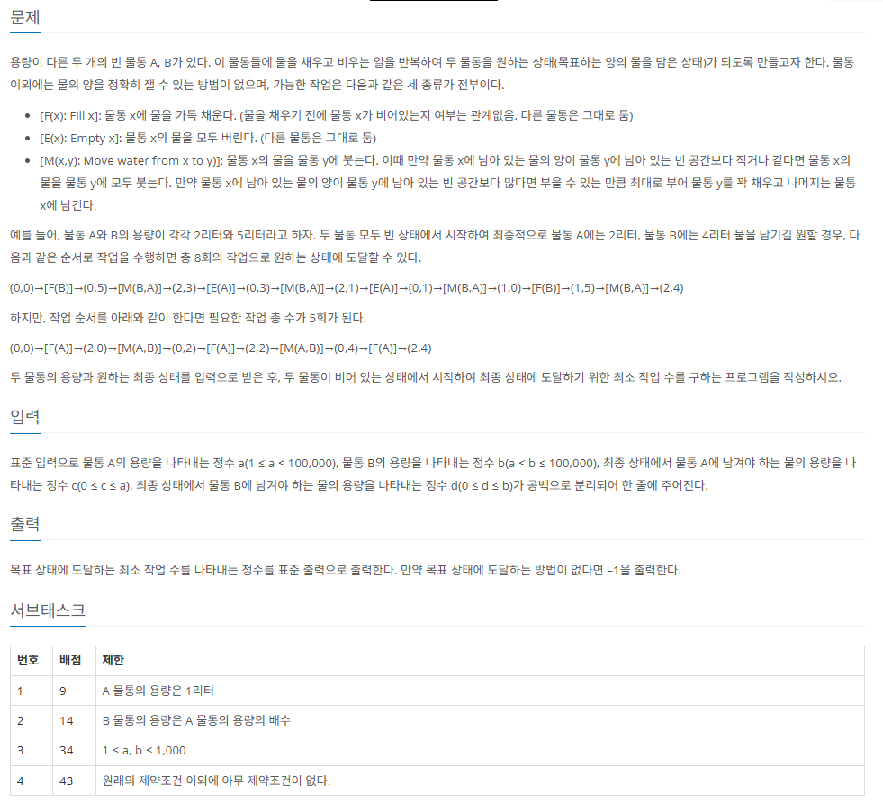

백준 14867번 물통 문제이다.



😂문제를 처음 든 사고과정
먼저 가장 쉽게 든 생각은 경우의 수가 6가지라는 점이었다. 이를 바탕으로 코드를 작성해서 dfs형식으로 작성하였다. dfs 구현 시 서브 테스트 몇몇을 통과하지 못할 가능성이 있다. 왜냐하면 dfs는 깊이우선 탐색으로 한 경우의 수를 끝까지 탐색해서 경우의 수를 찾기 때문에, 이 문제의 경우 6가지의 경우의 수를 시도해 보아야하기 때문에, 가지치지 없는 모든 상태를 탐색하려고 하기 보다는 bfs를 사용한 너비우선 탐색에서는 목표상태에 처음 도달했을 때가 최소 작업 수를 도출하기 때문에 더 적절하다.

또한, 이문제에서는 물A,물B의 용량이 0< <100,000 이기 때문에, 2차원 배열로 모든 상태를 저장하기에는 메모리의 한계가 있으므로 map 자료형을 이용하여서 각각 상태에 해당하는 가짓수를 저장하는 방식을 사용했다.

```c++
#include <iostream>
#include <queue>
#include <map>
using namespace std;

int a, b, ta, tb;
int wa, wb;
int ret = 987654321;

queue<pair<int, int>> q;
map<pair<int, int>, int> m;

void enqueue(int x, int y, int cnt) {
	if (m[{x, y}]) return;
	m[{x, y}] = cnt;
	q.push({ x,y });
}

void four_task(int x, int y) {
	m[{x, y}] = 1;
	q.push({ x,y });
	while (!q.empty()) {
		int q1 = q.front().first;
		int q2 = q.front().second;
		q.pop();

		// fill , empty , move logic

		// fill A
		enqueue(a, q2, m[{q1,q2}] + 1);
		// fill B
		enqueue(q1, b, m[{q1, q2}] + 1);
		// empty A
		enqueue(0, q2, m[{q1, q2}] + 1);
		// empty B
		enqueue(q1, 0, m[{q1, q2}] + 1);
		// move A to B
		enqueue(max(0, q1 - (b - q2)), min(q1 + q2, b) , m[{q1, q2}]+1);
		// move B to A
		enqueue(min(q1 + q2, a), max(0, q2 - (a - q1)), m[{q1, q2}] + 1);
	}

}

int main() {
	cin >> a >> b >> ta >> tb;
	four_task(0, 0);
	if (m[{ta, tb}]) cout << m[{ta, tb}] - 1;
	else cout << -1;
}
```