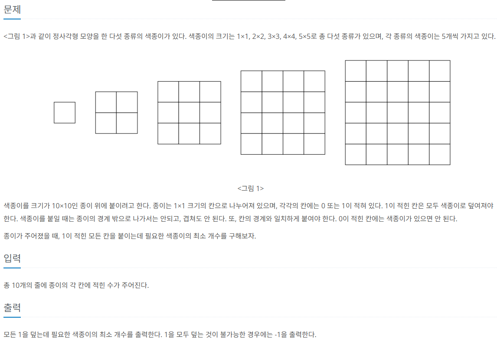

백준 17136번 색종이 붙이기 문제이다.



😂문제를 처음 읽고 이루어진 사고과정
문제를 읽고 처음 든 생각은 brute force로 접근하는 방식이었다. 효율성을 높이기 위해서 가장 큰 색종이인 5X5사이즈의 색종이를 우선으로 사용하여서, 최소값을 갱신해 나가려고 하는 것이 처음 든 생각이었다. 하지만, 구현으로 하기까지의 코딩 구현 능력이 떨어져서 코드로 구현하지는 못했다.

---

결국 이문제의 정답을 보면서 코드를 이해해 나가기로 하였다.
내가 생각하기에 이문제에서 중요한 코드 구현력은 다음과 같다. 먼저, 색종이를 size별로 접었을 때 각 색종이 개수 감소와 함께 종이 위에 색종이를 붙였을 때의 상황으로 들어가 재귀문을 실행하고, 재귀문을 나왔을 때에는 종이의 좌표를 원복, 색종이의 개수를 원복하는 과정을 구현하는 것이 이문제의 주요 코드 구현 능력인 것 같다.

---

```c++
#include <iostream>
using namespace std;

int m[14][14];
int use[6];
const int INF = 987654321;
int ret = INF;
int n = 10;

bool check(int y, int x, int size) {
	if (y + size > n || x + size > n) return false;
	for (int i = 0; i < size; i++) {
		for (int j = 0; j < size; j++) {
			if (m[y + i][x + j] == 0) return false;
		}
	}
	return true;
}

void draw(int y, int x, int size, int what) {
	for (int i = 0; i < size; i++) {
		for (int j = 0; j < size; j++) {
			m[y + i][x + j] = what;
		}
	}
}

void dfs(int y, int x, int cnt)
{
	if (cnt >= INF) return;
	if (x == n) {
		dfs(y + 1, 0, cnt);
		return;
	}
	if (y == n) {
		ret = min(ret, cnt);
		return;
	}
	if (m[y][x] == 0) {     
		dfs(y, x + 1, cnt);
	}
	// 실제 색종이 붙이는 코드
	for (int size = 5; size >= 1; size--) {
		if (use[size] >= 5) return;
		if (check(y, x, size)) {
			use[size]++;
			draw(y, x, size, 0);// 0으로 바꾸는 코드
			dfs(y, x + size, cnt + 1);
			draw(y, x, size, 1);// 1로 원복하는 코드
			use[size]--;
		}
	}
}

int main() {
	for (int i = 0; i < 10; i++) {
		for (int j = 0; j < 10; j++) {
			cin >> m[i][j];
		}
	}
	
	dfs(0, 0, 0);
	cout << (ret == INF ? -1 : ret) << "\n";

}
```


코드를 보았을 때, 함수 2개를 구현하였는데, 
첫번째로, **check** 함수는 종이 좌표평면에서 y,x를 왼쪽 꼭짓점으로 하고, sizeXsize 크기의 색종이를 붙였을 때 경계조건을 체크하는 함수이다.
두번째로, **draw** 함수는 종이 좌표평면에서 y,x를 왼쪽 꼭짓점으로 잡고, sizeXxize 크기의 색종이를 붙였을 때 종이 좌표를 바꾸는 함수이다. 인자로 int형 what을 넣은 이유는 backtracking의 특성상 한 case를 수행하고 재귀문으로 들어가서 수행을 반복하는데, 재귀문을 나왔을 경우 원래 case로 원복을 시켜주어야 하기 때문에, 실제 색종이를 붙일 경우에는 what에 1을 넣어주고, 원복을 원할 경우에는 what에 0을 넣어주어서 원복이 가능하게 하였다.
마지막으로, **dfs**함수를 살펴보면, 반복문을 사용하지 않고 재귀함수를 통해서 모든 좌표의 case를 수행하고 있는 것을 확인할 수 있다. 이경우 한 행을 모드 체크하고 다음 행으로 넘어가는 형식으로 구현하였는데, 즉 (x==n)인 경우 한 행을 모두 체크하였기 때문에, 다음 행의 시작 좌표인 y+1,0을 넣어주어서 다음 재귀를 수행하였고, 모든 행의 계산이 완료되면 ret과 cnt값을 비교해서 더 작은값을 ret에 저장한다.