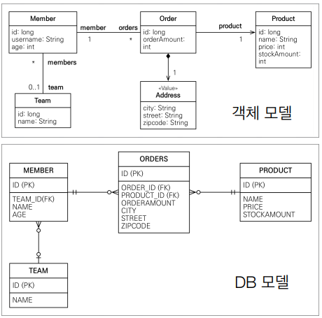
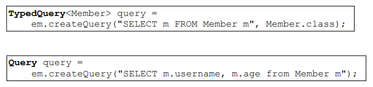

## 객체지향 쿼리 언어(JPQL)

JPQL
* JPA를 사용하면 엔티티 객체를 중심으로 개발
* 문제는 검색쿼리이다
* 검색을 할 때에도 테이블이 아닌 엔티티 객체를 대상으로 탐색
* 모든 DB 데이터를 객체로 변환해서 검색하는 것을 불가능
* 애플리케이션이 필요한 데이터만 DB에서 불러오려면, 결국 검색 조건이 포함된 SQL이 필요하다

JPQL과 실행된 SQL


Query DSL
* 문자가 아닌 자바코드로 JPQL을 작성할 수 있음
* 컴파일 시점에 오류를 찾을 수 있음
* JPQL builder 역할
* 동적 쿼리 작성이 편리하다
* 단순하고 쉽다 / 실무에서 사용이 권장됨

native SQL
* JPQ가 제공하는 SQL을 직접 사용하는 기능
* JPQL로 해결할 수 없는 특정 데이터베이스에 의존적인 기능


### JPQL
* JPQL은 객체지향 쿼리언어. **엔티티 객체를 대상으로 쿼리**
* JPQL은 결국 SQL로 변환된다
* JPQL은 SQL을 추상화해서 특정데이터베이스 SQL에 의존하지 않는다

**실습 table**


JPQL 문법
* ex ) select m from Member as m where m.age > 18
* JPQL 키워드는 대소문자 구분 X
* 엔티티 이름 사용, 테이블 이름이 아님
* 별칭은 필수

TypeQuery,Query
* TypeQuery : 반환 타입이 명확할 때 사용
* Query : 반환 타입이 명확하지 않을 때 사용



결과조회 API
* query.getResultList() : 결과가 하나 이상일 때, 리스트 반환 
=> 결과가 없으면 빈 리스트 반환
* query.getSingleResult() : 결과가 정확히 하나, 단일 객체 반환
=> 결과가 없거나, 둘 이상이면, Exception 발생시킴  

프로젝션
* SELECT 절에 조회할 대상을 지정하는 것
* 프로젝션 대상 : 엔티티, 임베디드, 스칼라 타입(숫자,문자 등 기본 데이터 타입)
* SELECT m FROM Mebmer m -> 엔티티 프로젝션
* SELECT m.team FROM Member m -> 엔티티 프로젝션
* SELECT m.address FROM Member m -> 임베디드 타입 프로젝션
* SELECT m.username, m.age FROM Member m -> 스칼라 타입 프로젝션

(Q)프로젝션으로 가지고 온 Entity는 영속성 컨텍스트에 관리가 될까? (o)

---

**엔티티 프로젝션**
```java
Member member = new Member();
member.setUsername("member1");
member.setAge(10);
em.persist(member);

em.flush();
em.clear();

// 영속성 컨텍스트에 관리가 됨
List<Member> result = em.createQuery("select m from Member m", Member.class).getResultList();
Member findMember = result.get(0);

// 영속성 컨텍스트에 관리가 되기 때문에 변경에 대해 update 쿼리문이 나감감
findMember.setAge(20);


// 실행
Hibernate: 
    /* insert com.jpa.Member
        */ insert 
        into
            Member
            (age, TEAM_ID, username, id) 
        values
            (?, ?, ?, ?)
Hibernate: 
    /* select
        m 
    from
        Member m */ select
            member0_.id as id1_0_,
            member0_.age as age2_0_,
            member0_.TEAM_ID as team_id4_0_,
            member0_.username as username3_0_ 
        from
            Member member0_
Hibernate: 
    /* update
        com.jpa.Member */ update
            Member 
        set
            age=?,
            TEAM_ID=?,
            username=? 
        where
            id=?
```

---

**임베디드 타입 프로젝션**
```java
// 임베디드 타입 프로텍션
Member member = new Member();
member.setUsername("member1");
member.setAge(10);
em.persist(member);

em.flush();
em.clear();

// Order에 있는 Address 컬럼 출력
em.createQuery("select o.address from Order o", Address.class).getResultList();


// 실행
select
	order0_.city as col_0_0_,
 	order0_.street as col_0_1_,
	order0_.zipcode as col_0_2_ 
from
	ORDERS order0_
```

---

**스칼라 타입 프로젝션**

(ex) select m.username, m.age from Member m
여러 값들을 조회해서 받아올 때에는, 어떤 변수를 사용해야 할까?
1. Query 타입으로 조회
2. Object[] 타입으로 조회
3. new 명령어로 조회

```java
// 스칼라 타입 프로젝션
Member member = new Member();
member.setUsername("member1");
member.setAge(10);
em.persist(member);

em.flush();
em.clear();

// 타입이 2개인데 어떻게 받을 수 있을까?
//        em.createQuery("select distinct m.username, m.age from Member m").getResultList();

// 1. Query 타입 조회
Query query = em.createQuery("select distinct m.username, m.age from Member m");
// => List[Object] 형태로 결과를 반환해줌

Object o = resultList.get(0);
Object[] result = (Object[]) o;
System.out.println("username = " + result[0]);
System.out.println("age = " + result[1]);

// 2. Obejct[] 타입
List<Object[]> resultList = em.createQuery("select distinct m.username, m.age from Member m").getResultList();

Object[] result = resultList.get(0);
System.out.println("username = " + result[0]);
System.out.println("age = " + result[1]);

// 3. **new 명령어로 조회**
// 사용자정의 class인 MemberDTO명으로 값을 조회하는 것
List<MemberDTO> resultNew = em.createQuery("select new com.jpa.MemberDTO(m.username, m.age) from Member m", MemberDTO.class).getResultList();
MemberDTO memberDTO = resultNew.get(0);
System.out.println("memberDTO.username = " + memberDTO.getUsername());
System.out.println("memberDTO.age = " + memberDTO.getAge());
```

**페이징 API**

페이징
-> 한번에 데이터를 가져오는 것이아닌, 조금씩 나누어서 가져오는 것

JPA에서의 페이징 메서드
1. setFirstResult(int startPosition)
어디서부터 데이터를 가져올지 정함
0부터 시작

2. setMaxResults(int maxResult)
몇 개의 데이터를 가져올지 정함

페이징 API 예시 코드
```java
//페이징 쿼리
 String jpql = "select m from Member m order by m.name desc";
 List<Member> resultList = em.createQuery(jpql, Member.class)
 .setFirstResult(10)
 .setMaxResults(20)
 .getResultList();
```

**조인**

1. 조인 대상 필터링
ex) 회원과 팀을 조회하면서, 팀 이름인 A인 팀만 조인
JPQL : select m, t from Member m left join m.team t on t.name='A'

SQL  : select m.*, t.* from Member m LEFT JOIN Team t on m.TEAM_ID=t.id and t.name='A'

2. 연관관계 없는 엔티티 외부 조인
ex) 회원의 이름과 팀의 이름이 같은 대상 외부 조인
JPQL : select m,t from Member m LEFT JOIN Team t on m.username=t.name

SQL  : select m.*,t.* from Member m LEFT JOIN Team t ON m.username=t.name

**서브쿼리 지원함수**
-  EXISTS : 서브쿼리에 결과가 존재하면 참   
    - ALL/ANY/SOME
    - ALL은 모두 만족하면 참
    - ANY,SOME은 같은 의미로, 조건을 만족하면 참
- [NOT] IN : 서브쿼리의 결과 중 하나라도 같은것이 있으면 참

**조건식**
- COALESCE : 하나씩 조회해서 null이 아니면 반환
(ex) 사용자 이름이 없으면 '이름 없는 회원'을 반환
```jpa
select coalesce(m.username,'이름 없는 회원') from Member m
```
- NULLIF : 두 값이 같으면 null반환, 다르면 첫번째 값 반환
```jpa
select NULLIF(m.username, '관리자') form Member m
``


