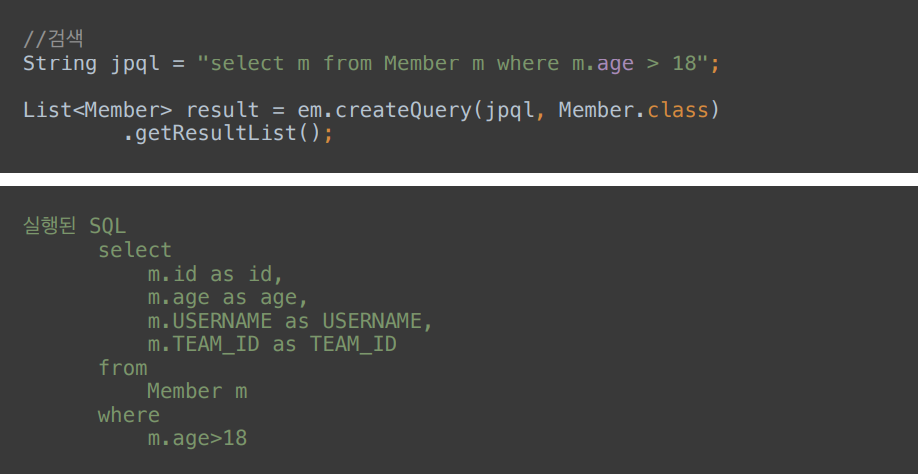

## 객체지향 쿼리 언어(JPQL)

JPQL
* JPA를 사용하면 엔티티 객체를 중심으로 개발
* 문제는 검색쿼리이다
* 검색을 할 때에도 테이블이 아닌 엔티티 객체를 대상으로 탐색
* 모든 DB 데이터를 객체로 변환해서 검색하는 것을 불가능
* 애플리케이션이 필요한 데이터만 DB에서 불러오려면, 결국 검색 조건이 포함된 SQL이 필요하다

JPQL과 실행된 SQL

Query DSL
* 문자가 아닌 자바코드로 JPQL을 작성할 수 있음