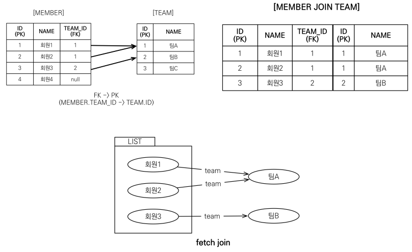

**경로표현식**
- .(점)을 찍어 객체 그래프를 탐색하는 것

경로표현식 용어 정리
- 상태필드(state field) : 단순히 값을 저장하기 위한 필드

- 연관필드(association field) : 연관관계를 위한 필드
    - 단일 값 연관 필드 : 대상이 엔티티
    - 컬렉션 값 연관 필드 : 대상이 컬렉션


경로표현식 특징
- 상태필드 : 경로 탐색의 끝, 탐색 X
- 단일 값 연관 경로 : 묵시적 내부 조인 발생, 탐색 O
- 컬렉션 값 연관 경로 : 묵시적 내부 조인 발생, 탐색 X

(ex)상태 필드 경로 탐색
- JPQL : select m.username, m.age from Mebmer m

(ex)단일 값 연관 경로 탐색
- JPQL : select o.member from Order o
=> 묵시적으로 inner join이 발생한다

(ex)컬렉션 값 연관 경로
- JPQL : select t.members from Team

명시적 조인 vs 묵시적 조인
- 명시적 조인 : join 키워드 직접 자용
=> 실무에서는 명시적 조인을 사용하는 것이 바람직하다!
- 묵시적 조인 : 경로 표현식에 의해 묵시적으로 SQL 조인 발생(내부조인만 가능)


**JPQL- fetch join(페치조인)**
- JPQL에서 성능 최적화를 위해 제공되는 기능
- 연관된 엔티티나 컬렉션을 한번의 SQL로 함께 조회하는 기능
- join fetch 명렁어 사용

엔티티 패치 조인
- 회원을 조회하면서 연관된 팀도 함께 조인(SQL 한번에)
- JPQL : select m from Member m join fetch m.team
=> SQL : select m.*,t.* from Member m INNER JOIN TEAM T on m.team_id = t.id




<br>
위와같이 fetch join을 하게되면, Member와 연관관계를 맺은 Team 객체 까지 한꺼번에 조인하는 것을 확인 할 수 있다.


- join fetch 를 사용하지 않은 코드

```java
Team teamA = new Team();
teamA.setName("팀A");
em.persist(teamA);

Team teamB = new Team();
teamB.setName("팀B");
em.persist(teamB);

Member member1 = new Member();
member1.setUsername("회원1");
member1.setTeam(teamA);
em.persist(member1);

Member member2 = new Member();
member2.setUsername("회원2");
member2.setTeam(teamA);
em.persist(member2);

Member member3 = new Member();
member3.setUsername("회원3");
member3.setTeam(teamB);
em.persist(member3);

em.flush();
em.clear();

String query = "select m from Member m";
List<Member> resultList = em.createQuery(query, Member.class).getResultList();

for (Member member : resultList) {
System.out.println("member = " + member.getUsername() + ", " +
member.getTeam().getName());
}


// 실행문
Hibernate: 
    /* select
        m 
    from
        Member m */ select
            member0_.id as id1_0_,
            member0_.age as age2_0_,
            member0_.TEAM_ID as team_id4_0_,
            member0_.username as username3_0_ 
        from
            Member member0_
Hibernate: 
    select
        team0_.TEAM_ID as team_id1_3_0_,
        team0_.name as name2_3_0_ 
    from
        Team team0_ 
    where
        team0_.TEAM_ID=?
member = 회원1, 팀A
member = 회원2, 팀A
Hibernate: 
    select
        team0_.TEAM_ID as team_id1_3_0_,
        team0_.name as name2_3_0_ 
    from
        Team team0_ 
    where
        team0_.TEAM_ID=?
member = 회원3, 팀B
```

<br>
위는 fetch join을 사용하지 않고 MEmber를 조회한 쿼리문이다.
쿼리문 select m from Member m 를 join fetch를 사용한 쿼리문으로 바꾸면 다음과 같다. <br>
>> String query = "select m from Member m join fetch m.team"

```java
// 실행문
Hibernate: 
    /* select
        m 
    from
        Member m 
    join
        fetch m.team */ select
            member0_.id as id1_0_0_,
            team1_.TEAM_ID as team_id1_1_1_,
            member0_.age as age2_0_0_,
            member0_.TEAM_ID as team_id4_0_0_,
            member0_.username as username3_0_0_,
            team1_.name as name2_1_1_ 
        from
            Member member0_ 
        inner join
            Team team1_ 
                on member0_.TEAM_ID=team1_.TEAM_ID
member = 회원1, 팀A
member = 회원2, 팀A
member = 회원3, 팀B
```
처음의 결과와는 다르게 select query가 한번만 나가는 것을 확인 할 수 있다.

**페치 조인의 특징과 한계**

1. 페치 조인의 대상에는 별칭을 줄 수 없다.
2. 둘 이상의 컬렉션은 페치 조인 할 수 없다.
```jpa
@Entity
public class Team {
    @OneToMany(mappedBy = "team")
    private List<Member> members;

    @OneToMany(mappedBy = "team")
    private List<Project> projects;
}

// ❌ 아래는 오류 발생
String jpql = "select t from Team t join fetch t.members join fetch t.projects";
```
=> JPA는 1:N 관계를 두 개 이상 fetch join하면 데이터 부풀림(cartesian product)현상이 생기기 때문에 금지돼 있다.

**해결방법**
패치 조인은 1개만 하고, 나머지는 LAZY + @BatchSize를 이용한다.

3. 컬렉션을 페치 조인하면 페이징 API 사용 불가
```jpa
String jpql = "select t from Team t join fetch t.members";
List<Team> result = em.createQuery(jpql, Team.class)
    .setFirstResult(0)
    .setMaxResults(10) // ❌ 작동 안함
    .getResultList();
```
=> Team 하나에 Member 여러 명이 조인되기 때문에, 페이징 기준이 모호해진다. DB에서는 Team X Member 만큼의 행 생성됨


**N+1 문제**
```java
@Entity
public class Team {
    @Id @GeneratedValue
    private Long id;

    private String name;

    @OneToMany(mappedBy = "team")
    private List<Member> members;

    @OneToMany(mappedBy = "team")
    private List<Project> projects;
}

@Entity
public class Member {
    @Id @GeneratedValue
    private Long id;

    private String name;

    @ManyToOne
    private Team team;
}

@Entity
public class Project {
    @Id @GeneratedValue
    private Long id;

    private String title;

    @ManyToOne
    private Team team;
}
```

예를 들어서 위의 코드에서 10개의 Team을 조회한다고 하면 쿼리는 다음과같다
```
List<Team> teams = em.createQuery("select t from Team t",Team.class).getResultList();

for (Team team : teams) {
    List<Project> projects = team.getProjects(); // 여기서 SQL 또 날아감!
}
```
결과적으로,
1. select * from team -> 1번실행
2. select * from project where team_id = ? -> 10번실행
=> 즉 1+N번 실행된다!


페치 조인의 특징 이어서
* 연관된 엔티티들을 SQL 한 번으로 조회 - 성능 최적화
* 엔티티에 직접 적용하는 글로벌 로딩 전략보다 우선함
(ex) 글로벌 로딩 전략 - FetchType.LAZY
* 최적화가 필요한 곳에 페치 조인 사용

**벌크연산**
- 재고가 10개 미만인 상품의 가격을 10% 상승하려면?
- JPA 변경 감지 기능으로 너무 많은 SQL 이 실행됨
=> 해결방법 : 벌크연산!

벌크연산 예시
- 쿼리 한번으로 여러 테이블 로우 변경(엔티티)
- executeUpdate() 의 결과는 영향받은 엔티티 수 반환
- UPDATE , DELETE 지원
- INSERT
```
int resultcount = em.createQuery("update Member m set m.age = 20")
        .executeUpdate();

em.clear(); // 영속성 컨텍스트를 초기화한다음에 다시 조회!

Member findMember = em.find(Member.class, member1.getId());
System.out.println("findMember = " + findMember.getAge());
```

**벌크 연산 주의점**
- 벌크 연산은 영속성 컨텍스트를 무시하고 데이터베이스에 직접 쿼리
    - 벌크 연산을 먼저 실행
    - 벌크 연산 수행 후 영속성 컨텍스트 초기화
=> 벌크 연산 후, 영속성 컨텍스트를 조회하기 위해서는 em.clear()로 영속성 컨텍스트 초기화 후 조회해야 한다!

