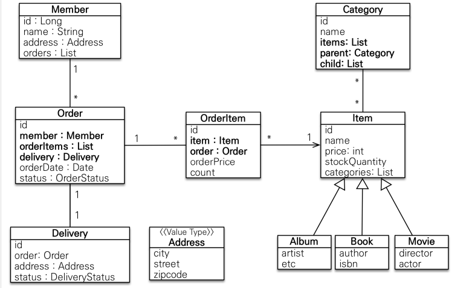
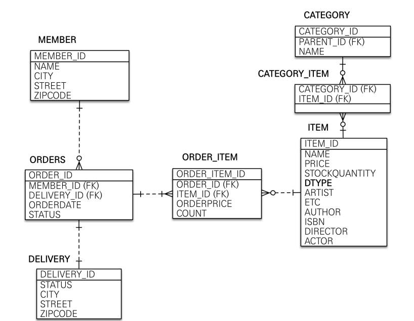

 #### 회원 엔티티 분석

 

**회원(Member)** 
이름, 임베디드타입(Address), 주문(order) 리스트를 가진다.

**주문(Order)**
한번 주문 시 여러 상품을 주문 가능 => OrderItem과 일대다 관계
상품을 주문한 회원과 배송정보, 주문 날짜, 주문상태(enum)를 가지고 있다.

**배송(Delivery)**
주문 하나당 배송 정보 하나를 가지고 있다. 주문과 배송은 일대일 관계이다.

**주문 상품(OrderItem)**
주문한 상품 정보, 주문 금액(orderPrice), 주문 수량(count)를 가진다.

**상품(Item)**
이름, 가격, 재고수량(stockQuantity)를 가지고 있다. 

**카테고리(Category)**
상품과 다대다 관계를 맺는다. parent,child로 부모 자식 관계를 연결한다.

**주소(Address)**
임베디드 타입. 회원과 배송(Delivery)에서 사용한다.


#### 회원 테이블 분석


**MEMBER**
회원 엔티티의 Address 임베디드 타입 정보가 회원 테이블에 그대로 들어갔다.(DELIVERY 테이블도 마찬가지)

**ITEM**
앨범,도서,영화 타입을 통합해서(SingleTable 전략)하나의 테이블로 만들었다. DTYPE 컬럼으로 타입을 구분

#### 연관관계 매핑 분석

회원과 주문(일대다,다대일 연관관계)
주문이 "다" 쪽이므로, 주문을 연관관계의 주인으로 설정하는 것이 좋다.
=> Order.member 를 ORDERS.MEMBER_ID와 매핑한다.

주문상품과 주문(다대일 양방향 관계)
외래키가 주문상품에 있으므로, 주문상품이 연관관계의 주인이다.
=> OrderItem.order 를 ORDER_ITEM.ORDER_ID와 매핑한다.

참고 : 외래 키가 있는 곳을 연관관계의 주인으로 정해라!

**회원 엔티티**
```java
package jpabook.jpashop.domain;

import jakarta.persistence.*;
import lombok.Getter;
import lombok.Setter;
import org.springframework.web.bind.annotation.GetMapping;

import java.util.ArrayList;
import java.util.List;

@Entity
@Getter @Setter
public class Member {
    @Id @GeneratedValue
    @Column(name = "member_id") // DB테이블에서는 column명을 member_id로 지정하는 곳
    private Long id;

    private String name;

    @Embedded
    private Address address;

    @OneToMany(mappedBy = "member") // order Table에 있는 member에 의해서 mapping 됨
    private List<Order> orders = new ArrayList<>(); // 컬렉션은 필드에서 바로 초기화하자!
}

```

**주문 엔티티**
```java
package jpabook.jpashop.domain;

import jakarta.persistence.*;
import lombok.Getter;
import lombok.Setter;
import org.springframework.boot.autoconfigure.jms.JmsProperties;

import java.time.LocalDateTime;
import java.util.ArrayList;
import java.util.List;

@Entity
@Table(name = "orders") // 매핑될 table의 이름
@Getter @Setter
public class Order {

    @Id @GeneratedValue
    @Column(name = "order_id")
    private Long id;

    @ManyToOne(fetch = FetchType.LAZY)
    @JoinColumn(name = "member_id")
    private Member member;

    // persist(order)만 하면 각 orderItem은 persist하지 않아도 됨
    @OneToMany(mappedBy = "order", cascade = CascadeType.ALL)
    private List<OrderItem> orderItems = new ArrayList<>();

    @OneToOne(fetch = FetchType.LAZY, cascade = CascadeType.ALL)
    @JoinColumn(name = "delivery_id") // 연관관계의 주인
    private Delivery delivery;

    private LocalDateTime orderDate; // 주문시간

    @Enumerated(EnumType.STRING)
    private orderStatus status; // ORDER , CANCEL

    // 연관관계 편의 메서드 // => 양방향 연관관계일 때 사용!
    public void setMember(Member member){
        this.member = member;
        member.getOrders().add(this);
    }

    public void addOrderItem(OrderItem orderItem){
        orderItems.add(orderItem);
        orderItem.setOrder(this);
    }

    public void setDelivery(Delivery delivery){
        this.delivery = delivery;
        delivery.setOrder(this);
    }
}

```
**연관관계 편의메서드**
* DB입장에서는 외래키의 참조와 변경에 따라, 참조되는 테이블이 변경되지만, 객체 세상에서는 그렇지 않다.
(ex)
```
Order order = new Order();
Member member = new Member();
order.setMember(member); // 연관관계 주인만 설정
```
위의 경우 DB에서는 외래키 member_id가 들어가지만, 자바 객체 메모리 상에서는 member.getOrders()는 여전히 비어있게 된다. => 그래프의 불일치 발생

* 연관관계 편의메서드는 양방향 연관관계가 있는 곳에서 사용한다.
* 연관관계 편의메서드는 연관관계의 주인쪽에 정의한다.

**주문상태**
```
package jpabook.jpashop.domain;
public enum OrderStatus {
 ORDER, CANCEL
}
```

**EnumType을 사용할때 주의점!!**
위와같은 주문상태 EnumType이 있다고 할 때, Default로 사용하는 값은 DB에 ORDER->1 , CANCEL->2 로 저장한다. 이때 Enum에 순서가 바뀌거나, 새로운 type을 추가시에 문제가 발생 할 수 있다.
[해결법]
@Enumerated(EnumType.STRING)을 사용하자!

**주문 상품 엔티티**
```java
package jpabook.jpashop.domain;

import jakarta.persistence.*;
import jpabook.jpashop.domain.item.Item;
import lombok.Getter;
import lombok.Setter;

@Entity
@Getter @Setter
public class OrderItem {
    @Id
    @GeneratedValue
    @Column(name = "order_item_id") // 속성의 column 이름
    private Long id;

    @ManyToOne(fetch = FetchType.LAZY)
    @JoinColumn(name = "item_id")
    private Item item;

    @ManyToOne(fetch = FetchType.LAZY)
    @JoinColumn(name = "order_id")
    private Order order;

    private int orderPrice;
    private int count;
}

```

주문상품 엔티티는 Item 과 order와 다대일 연관관계를 맺고 있고, 연관관계의 주인이 되어서 @JoinColumn을 이용하여서 외래 키를 설정해 주는 것을 코드에서 확인할 수 있다.

**상품 엔티티**
```java
package jpabook.jpashop.domain.item;

import jakarta.persistence.*;
import jpabook.jpashop.domain.Category;
import lombok.Getter;
import lombok.Setter;

import java.util.ArrayList;
import java.util.List;

@Entity
@DiscriminatorColumn(name = "dtype")
@Inheritance(strategy = InheritanceType.SINGLE_TABLE)
@Getter @Setter
public class Item {
    @Id
    @GeneratedValue
    @Column(name = "item_id")
    private Long id;

    private String name;
    private int price;
    private int stockQuantity;

    @ManyToMany(mappedBy = "items")
    private List<Category> categories = new ArrayList<>();

}
```
**도서,음반,영화 엔티티**
```java
@Entity
@DiscriminatorValue("A")
@Getter @Setter
public class Album extends Item{
    private String artist;
    private String etc;
}

@Entity
@DiscriminatorValue("B")
@Getter @Setter
public class Book extends Item{
   private String author;
   private String isbn;
}

@Entity
@DiscriminatorValue("M")
@Getter @Setter
public class Movie extends Item{
    private String director;
    private String actor;
}
```
[Single Table 전략에서 사용하는 개념]

@DiscriminatorColumn(name = "dtype")
-> DB테이블에 dtype이라는 컬럼이 추가됨
@DiscrimatorValue("X")
-> 이 클래스는 dtype="X"일 때 매핑 되도록 설정

**카테고리 엔티티**
```java
package jpabook.jpashop.domain;

import jakarta.persistence.*;
import jakarta.websocket.server.ServerEndpoint;
import jpabook.jpashop.domain.item.Item;
import lombok.Getter;
import lombok.Setter;

import java.util.ArrayList;
import java.util.List;

@Entity
@Getter @Setter
public class Category {
    @Id @GeneratedValue
    @Column(name = "category_id")
    private Long id;

    private String name;

    @ManyToMany
    @JoinTable(name = "category_item",
            joinColumns = @JoinColumn(name = "category_id"),
            inverseJoinColumns = @JoinColumn(name = "item_id")
    )
    private List<Item> items = new ArrayList<>();

    // Category 부모,자식 연관관계를 Category 내부 클래스에서 정의 => (질문) 6분 28초 참고해서 정리
    @ManyToOne(fetch = FetchType.LAZY)
    @JoinColumn(name = "parent_id")
    private Category parent;

    @OneToMany
    private List<Category> child = new ArrayList<>();

    public void addChildCategory(Category child){
        this.child.add(child);
        child.setParent(this);
    }


}
```

Category와 Item은 다대다 관계를 맺는 것을 확인 할 수 있다. 다대다 관계는 중간 테이블이 필요하다.(다대다를 -> 일대다+다대일로 풀어내기 위해서)
```
    @ManyToMany
    @JoinTable(name = "category_item",
            joinColumns = @JoinColumn(name = "category_id"),
            inverseJoinColumns = @JoinColumn(name = "item_id")
    )
    private List<Item> items = new ArrayList<>();
```
category_item : 중간 table의 이름 (DB에 category_item 테이블 생성)
joinColumns를 통해서 현재 엔티티(Category)가 중간 테이블에 어떤 외래 키로 연결되는지 설정
inverseJoinColumns를 통해서 반대쪽 엔티티(Item)가 중간 테이블에 연결되는 방식 설정


**참고**
실무에서는 @ManyToMany를 사용하지 않는다.@ManyToMany 는 편리한 것 같지만, 중간 테이블( CATEGORY_ITEM )에 컬럼을 추가할 수 없고, 세밀하게 쿼리를 실행하기 어렵기 때문에 실무에서 사용하기에는 한계가 있다. 중간 엔티티(CategoryItem 를 만들고 @ManyToOne , @OneToMany 로 매핑해서 사용하자. 정리하면 다대다 매핑을 일대다, 다대일 매핑으로 풀어내서 사용하자.

**주소값 타입**
```java
package jpabook.jpashop.domain;

import jakarta.persistence.Embeddable;
import lombok.Getter;

@Embeddable
@Getter // 값 타입은 변경이 되어서는 안된다! => 따라서, getter만 적용했다.
public class Address {
    private String city;
    private String street;
    private String zipcode;

    protected Address(){   // Reflection 이나 Proxy같은 기능을 사용하기 위해서 기본 생성자 사용
    }

    public Address(String city, String street, String zipcode) {
        this.city = city;
        this.street = street;
        this.zipcode = zipcode;
    }
}

```

참고: 값 타입은 변경 불가능하게 설계해야 한다.
@Setter 를 제거하고, 생성자에서 값을 모두 초기화해서 변경 불가능한 클래스를 만들자. JPA 스펙상 엔티티나
임베디드 타입( @Embeddable )은 자바 기본 생성자(default constructor)를 public 또는 protected 로
설정해야 한다. public 으로 두는 것 보다는 protected 로 설정하는 것이 그나마 더 안전하다.
JPA가 이런 제약을 두는 이유는 JPA 구현 라이브러리가 객체를 생성할 때 리플랙션 같은 기술을 사용할 수 있도
록 지원해야 하기 때문이다.


**모든 연관관계는 지연로딩**으로 설정!
* 즉시로딩(EAGER)은 예측이 어렵고, 어떤 SQL이 실행될지 알기 어렵다.
* 실무에서는 모든 연관관계를 LAZY로 설정해야함 => (ex)@ManyToOne(fetch=FETCHTYPE.LAZY)
* @XToOne(OneToOne, ManyToOne) 관계는 기본이 즉시로딩이므로 직접 지연로딩으로 설정해야 한다

**컬렉션은 필드에서 초기화하자**
* null문제에서 안전

